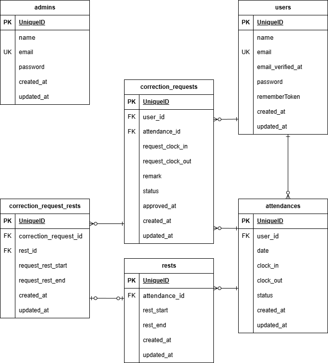

# coachtech 勤怠管理アプリ

勤怠打刻・管理を行うWebアプリケーションです。一般ユーザーによる出退勤打刻・修正申請と、管理者による勤怠管理・承認機能を提供します。


## アプリケーションURL

- ユーザー画面: http://localhost
- 管理者画面: http://localhost/admin/login
- phpMyAdmin: http://localhost:8080

## 機能一覧

- 会員登録・ログイン（メール認証付き）
- 出勤・退勤・休憩の打刻
- 勤怠一覧表示（月別）
- 勤怠詳細表示・修正申請
- 管理者ログイン
- 管理者による勤怠一覧表示（日別・全ユーザー）
- 管理者によるスタッフ一覧・スタッフ別勤怠表示
- 管理者による修正申請の承認
- CSV出力

## 使用技術（実行環境）

- PHP 8.1
- Laravel 8.75
- MySQL 8.0.26
- nginx 1.21.1
- Docker / Docker Compose

## テーブル設計



詳細は [テーブル定義書](docs/table-specification.md) を参照。

## 環境構築

### 前提条件

- Docker / Docker Compose がインストールされていること

### セットアップ手順

1. リポジトリをクローン

```bash
git clone git@github.com:syosinsyananasi/coachtech-attendance.git
cd coachtech-attendance
```

2. 環境変数ファイルを作成

```bash
cp src/.env.example src/.env
```

3. `src/.env` のDB設定を以下に変更

```
DB_HOST=mysql
DB_DATABASE=laravel_db
DB_USERNAME=laravel_user
DB_PASSWORD=laravel_pass
```

4. セットアップ（コンテナ起動〜マイグレーション〜シーディングまで一括）

```bash
make setup
```

5. アプリケーションにアクセス: http://localhost

## アカウント情報

### 管理者

| メールアドレス | パスワード |
|--------------|-----------|
| admin@coachtech.com | password123 |

### 一般ユーザー

| 名前 | メールアドレス | パスワード |
|------|--------------|-----------|
| 西 伶奈 | reina.n@coachtech.com | password123 |
| 山田 太郎 | taro.y@coachtech.com | password123 |

上記を含む計6名がシーディングで作成されます。または会員登録画面から新規登録できます。

## メール認証

本アプリケーションでは会員登録時にメール認証が必要です。メール認証には Mailtrap を使用しています。

### 設定手順

1. [Mailtrap](https://mailtrap.io/) でアカウントを作成する
2. Mailtrap の Inbox から SMTP 設定情報を取得する
3. `src/.env` に以下を設定する

```bash
MAIL_MAILER=smtp
MAIL_HOST=sandbox.smtp.mailtrap.io
MAIL_PORT=2525
MAIL_USERNAME=（Mailtrapで取得したユーザー名）
MAIL_PASSWORD=（Mailtrapで取得したパスワード）
MAIL_ENCRYPTION=tls
MAIL_FROM_ADDRESS=no-reply@example.com
MAIL_FROM_NAME="${APP_NAME}"
```

### 認証の流れ

1. 会員登録後、登録メールアドレス宛に認証メールが送信される
2. メール認証誘導画面の「認証はこちらから」ボタンから Mailtrap にアクセスする
3. Mailtrap の Inbox に届いた認証メール内のリンクをクリックする
4. メール認証が完了し、勤怠打刻画面に遷移する

※ シーディングで作成されたユーザーは認証済みのため、メール認証なしでログインできます。

## テスト

PHPUnit を使用した Feature テストを実装しています。

### テスト環境の設定

テストでは本番用とは別のデータベース `demo_test` を使用します。

1. テスト用データベースを作成する

```bash
make create-test-db
```

2. テスト用環境変数ファイルを作成する

```bash
cp src/.env src/.env.testing
```

3. `src/.env.testing` のDB設定を以下に変更する

```
APP_ENV=testing
DB_CONNECTION=mysql_test
DB_HOST=mysql
DB_PORT=3306
DB_DATABASE=demo_test
DB_USERNAME=root
DB_PASSWORD=root
```

4. `config/database.php` に `mysql_test` 接続が定義されていることを確認する

5. `phpunit.xml` でテスト用の接続設定が定義済みです

```xml
<server name="DB_CONNECTION" value="mysql_test"/>
<server name="DB_DATABASE" value="demo_test"/>
```

### テスト実行


# 全テスト実行

```bash
make test
```

# 特定のテストクラスを実行

```bash
docker-compose exec php php artisan test --filter=テストクラス名
```

